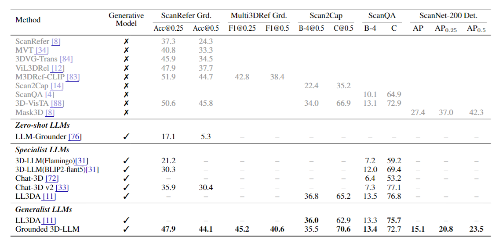
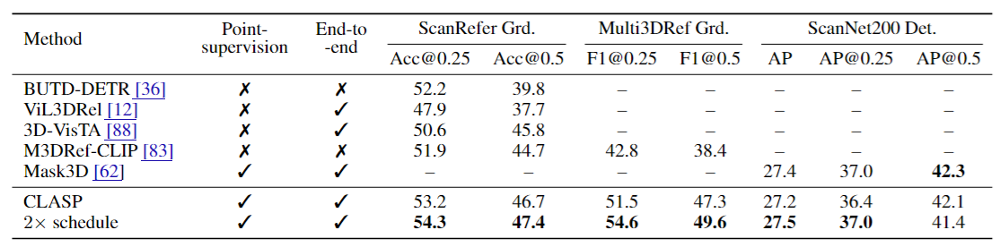

# Grounded 3D-LLM with Referent Tokens

This repository will release the official implementation of "Grounded 3D-LLM with Referent Token".

> [[`Paper`]](https://arxiv.org/pdf/2405.10370) [[`Arxiv`]](https://arxiv.org/abs/2405.10370) [[`Website`]](https://groundedscenellm.github.io/grounded_3d-llm.github.io/) [[`Data`]](https://mycuhk-my.sharepoint.com/:f:/g/personal/1155113995_link_cuhk_edu_hk/EpGS4c90LVVMvzio0UXgHfoB1u78-WpYaZfTuJj8qCbC4g?e=B2sufx)

## Abstract

Prior studies on 3D scene comprehension have primarily developed specialized models for specific tasks or required task-specific fine-tuning. In this study, we propose *Grounded 3D-LLM*, which explores the potential of 3D large multi-modal models (LMMs) to consolidate various 3D visual tasks within a unified generative framework. The model utilizes a series of ``referent tokens'' to reference 3D scenes, enabling the handling of sequences that interleave 3D and textual data arbitrarily. 3D vision tasks are naturally transformed into language formats through task-specific prompts. To effectively associate the scene with text, we curate the grounded language datasets either from human-annotated sources or by bootstrapping existing object labels at the phrase level. We then employ Contrastive Language-Scene Pre-training (CLASP) to bridge the divide between 3D vision and language models, thus facilitating the use of referent tokens in subsequent language modeling tasks. Our comprehensive evaluation covers open-ended tasks like 3D visual question answering and dense captioning, as well as close-ended tasks such as object detection and language grounding. 


## Main Results

<p>
    
    <em>Evaluation of 3D scene-level LMMs as a generalist.</em>
</p>

<p>
    
    <em>Comparison of CLASP with previous referring and detection methods.</em>
</p>

## Grounded Scene Caption Data Visualization

#### Step 1: Setup the environment.
```
pip install -r requirements.txt
# Requires Open3D library to process the ScanNet dataset (e.g. open3d==0.9.0)
```

#### Step 2: Data preparation

You can download processed ScanNet(~7G) from [our Huggingface repository]( https://huggingface.co/datasets/ShuaiYang03/Grounded_3D_LLM_with_Referent_Tokens_dataset) or prepare it by yourself.

1. Download the ScanNet dataset from the official [ScanNet website](http://www.scan-net.org/).
```bash
ln -s ScanNet_dataset ./data/rawscannet
```

2. Get ScanNet official repo for pre-processing.
```bash
mkdir third_party
cd third_party
git clone https://github.com/ScanNet/ScanNet.git
cd ScanNet/Segmentator
git checkout 3e5726500896748521a6ceb81271b0f5b2c0e7d2
make
```

3. Pre-process the scannet dataset as [Mask3D](https://github.com/JonasSchult/Mask3D).
```bash
python -m datasets.preprocessing.scannet_preprocessing preprocess \
--data_dir="./data/rawscannet" \
--save_dir="data/processed/scannet200" \
--git_repo="third_party/ScanNet" \
--scannet200=true
```

After preprocessing, please download the [grounded scene caption data](https://mycuhk-my.sharepoint.com/:f:/g/personal/1155113995_link_cuhk_edu_hk/EpGS4c90LVVMvzio0UXgHfoB1u78-WpYaZfTuJj8qCbC4g?e=B2sufx) and put it into the data folder as:
```bash
|-- 
|  |-- data
|     |-- rawscannet
|     |-- processed
|        |-- scannet200
|  |-- langdata
|     |-- groundedscenecaption_format.json
```

#### Step 3: Data visualization.
1. Run the visualization script to generate colorful point clouds. 
```bash
cd data_visualization
python visualize_grounded_text.py --datapath ../data/processed/scannet200 --langpath ../data/langdata/groundedscenecaption_format.json --count 10 --scene_id scene0000_00
```
This command accepts raw point cloud data and language annotations, displaying 10 captions in the scene `scene0000_00`.

2. Visualize the grounded scene caption and the respective scene point clouds in the http server.
```bash
cd visualizer
python -m http.server 7890
```

## ToDo List

- [x] Release Grouded Scene Caption data (ScanNet).
- [x] Release data visualizer.
- [ ] Release data generation code.
- [ ] Release pre-trained CLASP.
- [ ] Release Grounded 3D-LLM.

## Acknowledgement
Many thanks to the following open-source projects:
* [Mask3D](https://github.com/JonasSchult/Mask3D)
* [OpenScene](https://github.com/pengsongyou/openscene)
* [LISA](https://github.com/dvlab-research/LISA)
* [LAVIS](https://github.com/salesforce/LAVIS/tree/main)
* [Vicuna](https://github.com/lm-sys/FastChat/tree/main)

